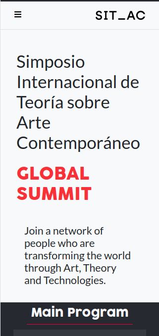
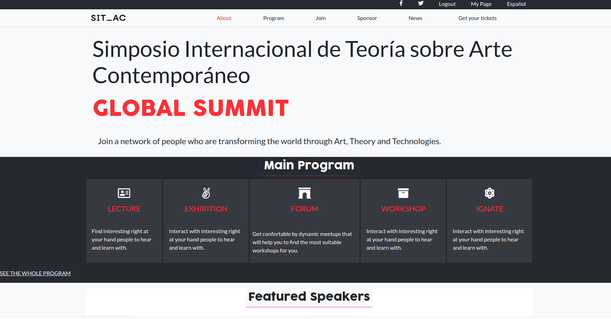

# CapstoneProject

HTML &amp; CSS Capstone Project is based on an online website for a conference.

It is a nicely done layout !

## Built With

- HTML5 & CSS3
    - Flexbox, grid
- SCSS compiler
- Bootstrap
- Github Pages
- Linters
- FontAwesome

## Live Demo

[Live Demo Link](https://rawcdn.githack.com/angelacuahutle/CapstoneProject/23d00020acad17803d146e94ac0f9a3b7aeb5492/index.html)

## Author

👤 **Angela Cuahutle**

- GitHub: [@angelacuahutle](https://github.com/angelacuahutle)
- Twitter: [@AngelaCunaDev](https://twitter.com/AngelaCunaDev)

## Issues 🤝 

Contributions, issues, and feature requests are welcome!

Feel free to check the [issues page](https://github.com/angelacuahutle/CapstoneProject/issues).

## Show your support

Give a ⭐️ if you like this project!

## 📝 License

This project is [MIT](./LICENSE) licensed.

