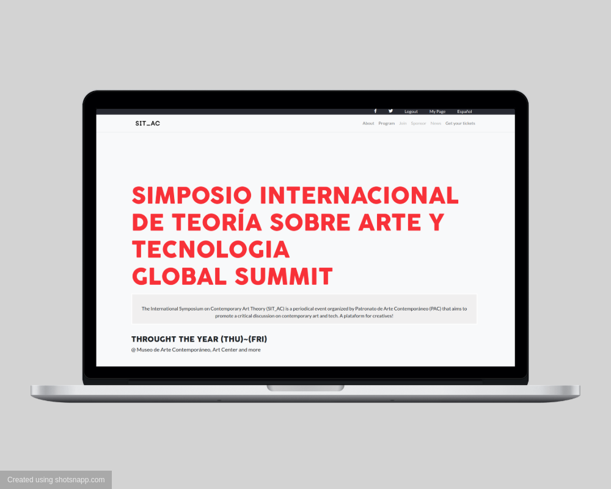
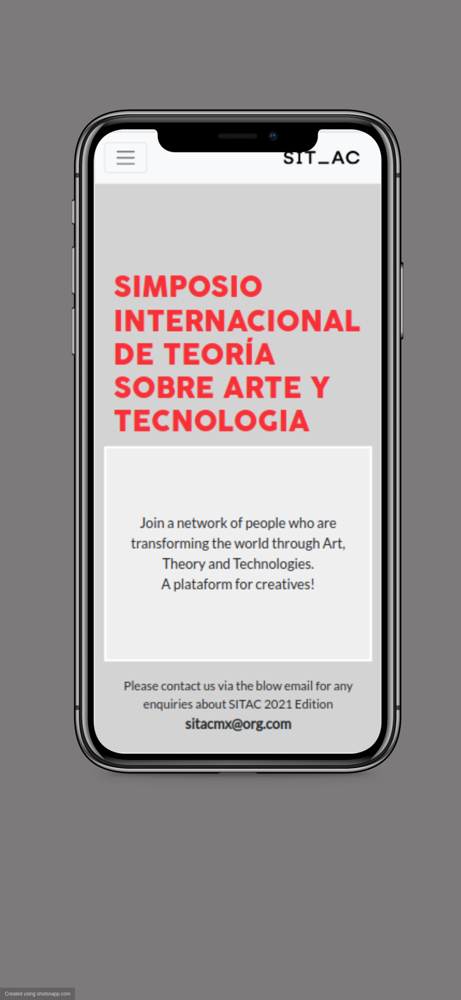

# CapstoneProject-

HTML &amp; CSS Capstone Project is based on an online website for a conference. This website was done as the final project of Micorverse's HTML/CSS curriculum
It is a website for a conference related to art and technology. It has the main landing page, an about us page and a tickets page.
The main page and the tickets page are responsive on two breakpoints: under 768px and over 768px. The page works best in Chrome, It includes HTML CSS and Bootstrap.

It is a nicely done layout !

## Built With

- HTML5 & CSS3
    - Flexbox, grid
- SCSS compiler
- Bootstrap
- Github Pages
- Linters
- FontAwesome

## Live Demo

[Live Demo Link](https://raw.githack.com/angelacuahutle/CapstoneProject/features/index.html)

## Presentation Video

[Video](https://www.loom.com/share/0c21e272c6974bfd9f4375ab858a8455)

## Getting Started

To get a local copy up and running follow these simple example steps.

# Requirements

Live Server plugin for Visual Studio Code

# Setup

1. Clone the repository
2. https://github.com/angelacuahutle/CapstoneProject.git
3. Open a folder on VS Code, right click the index.html file and click on "Open With Live Server"

Everything should be running by now!

## Atribution 

The Creative Commons license of the design requires to give appropriate credit to the author. 

This design is an idea originally by Cindy Shin on Behance

This is the original design layout: [https://www.behance.net/gallery/29845175/CC-Global-Summit-2015]

## Author

👤 **Angela Cuahutle**

- GitHub: [@angelacuahutle](https://github.com/angelacuahutle)
- Twitter: [@AngelaCunaDev](https://twitter.com/AngelaCunaDev)

## Issues 🤝 

Contributions, issues, and feature requests are welcome!

Feel free to check the [issues page](https://github.com/angelacuahutle/CapstoneProject/issues).

## Show your support

Give a ⭐️ if you like this project!

## 📝 License

This project is [MIT](./LICENSE) licensed.

